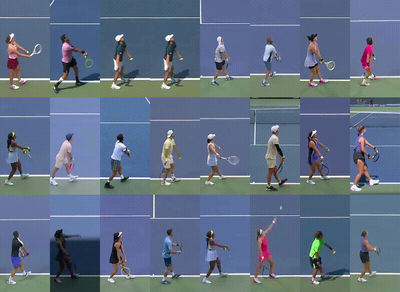
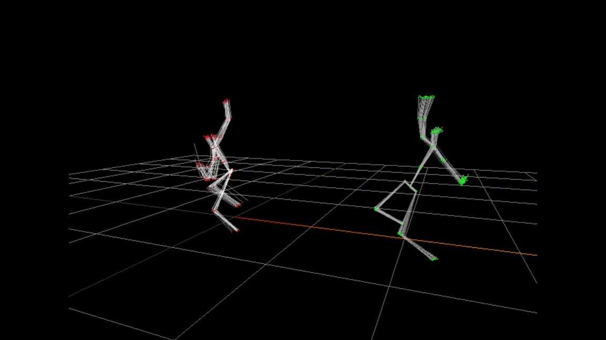

# Tennis Serve Analysis Dataset



### Comparative Skeletal Motion Analysis
<div align="center">
  
  <p><em>Skeletal motion comparison between two players showcasing biomechanical differences in serve technique</em></p>
</div>

A comprehensive dataset of tennis serves from the 2024 US Open, featuring 3D keypoint tracking, serve analysis, and gender classification data.

## 🎬 Additional Dimensionaltiy Reduction Visualizations 


### Gender-Based Motion Clustering
<div align="center">
  
  <p><em>3D motion space visualization revealing distinct separation patterns between male and female serve biomechanics</em></p>
</div>

### Player-Specific Serve Signatures  
<div align="center">
  
  <p><em>Individual player clustering in 3D motion space - each player develops unique biomechanical signatures</em></p>
</div>

## 🎾 Dataset Overview

This dataset contains **6,694 tennis serves** from the 2024 US Open tournament, featuring:

- **3D Keypoint Tracking**: 17 joints per frame with full body motion capture
- **Player Demographics**: 118 unique players (60 male, 58 female)
- **Serve Analytics**: Speed, direction, outcome, and match context
- **High-Quality Data**: Professional tournament footage with expert annotation

## 📊 Quick Stats

- **Total Serves**: 6,694
- **Unique Players**: 118 (60 male, 58 female)
- **Matches**: 118 different tennis matches
- **Frame Range**: 60-120 frames per serve (mean: 81.2 frames)
- **Data Format**: CSV with embedded JSON keypoint arrays *Work in Progress
- **Dataset Size**: ~1.3GB

## 🗂️ Repository Structure

```
tennis_serve_dataset/
├── data/
│   ├── raw/                    # Original data files
│   ├── processed/              # Cleaned and processed data
│   ├── models/                 # Pre-trained models (if any)
│   └── outputs/                # Analysis outputs and visualizations
├── documentation/
│   ├── data_dictionary.md      # Complete column descriptions
│   ├── keypoint_mapping.md     # 17 joint definitions and mapping
│   └── analysis_examples.md    # Usage examples and sample code
├── DATASET_README.md           # Detailed dataset documentation
├── LICENSE                     # MIT License
└── README.md                   # This file
```

## 🚀 Getting Started

### Download the Dataset

The main dataset file is located at:
```
data/processed/data.csv
```

### Quick Start Example

```python
import pandas as pd
import numpy as np
import json

# Load the dataset
df = pd.read_csv('data/processed/data.csv')

# Basic statistics
print(f"Total serves: {len(df)}")
print(f"Unique players: {df['server_name'].nunique()}")
print(f"Gender distribution:\n{df['server_gender'].value_counts()}")

# Load keypoints for analysis
keypoints = json.loads(df.iloc[0]['keypoints_clean'])
print(f"Keypoints shape: {np.array(keypoints).shape}")
# Output: (n_frames, 17, 3) - frames × joints × coordinates
```

## 📈 Key Features

### 🎯 Serve Data
- **Player Information**: Server name, gender, match details
- **Serve Metrics**: Speed, direction, outcome
- **Match Context**: Tournament round, court, date
- **Point Details**: Score, game state, rally length

### 🦴 3D Keypoint Tracking
- **17 Joints**: Full body tracking including arms, legs, torso
- **3D Coordinates**: X, Y, Z positions for each joint
- **Confidence Scores**: Reliability metrics for each keypoint
- **Frame-by-Frame**: Complete serve motion capture

### 👥 Player Demographics
- **Gender Distribution**: 54.7% Male, 45.3% Female
- **Player Diversity**: 118 unique players
- **Top Players**: Sinner (224 serves), Tiafoe (221 serves), Sabalenka (194 serves)

## 🔬 Research Applications

### Biomechanics
- Serve motion analysis and optimization
- Joint angle calculations and biomechanical modeling
- Performance comparison across players and genders

### Machine Learning
- Gender classification from motion patterns
- Serve outcome prediction
- Player identification and verification
- Motion synthesis and generation

### Sports Analytics
- Serve effectiveness analysis
- Player comparison studies
- Performance benchmarking and ranking

## 📋 Data Dictionary

### Core Columns
- `video_name`: Original video filename
- `server_name`: Name of the serving player
- `server_gender`: Gender of server (M/F)
- `player1`, `player2`: Match participants
- `PointServer`: Server identifier (1 or 2)
- `n_frames`: Number of frames in the serve sequence

### Keypoint Data
- `keypoints_clean`: 3D coordinates array (n_frames × 17 × 3)
- `keypoint_scores_clean`: Confidence scores array (n_frames × 17)

### Match Context
- `tournament`: Tournament name
- `round`: Match round
- `court`: Court information
- `date`: Match date

For complete column descriptions, see [data_dictionary.md](documentation/data_dictionary.md).

## 📊 Sample Analysis Results

### Serve Length Distribution
- **Mean**: 81.2 frames per serve
- **Range**: 60-120 frames
- **Most Common**: 90 frames (468 serves)

### Gender Analysis
- **Male Players**: 60 players, 3,659 serves (54.7%)
- **Female Players**: 58 players, 3,035 serves (45.3%)

### Top Players by Serve Count
1. **Jannik Sinner**: 224 serves
2. **Frances Tiafoe**: 221 serves  
3. **Taylor Fritz**: 214 serves
4. **Aryna Sabalenka**: 194 serves
5. **Jessica Pegula**: 169 serves

## 📝 Citation

If you use this dataset in your research, please cite:

```bibtex
@dataset{tennis_serve_analysis_2024,
  title={Tennis Serve Analysis Dataset: 3D Keypoint Tracking from US Open 2024},
  author={Tennis Analytics Research Team},
  year={2024},
  url={https://github.com/jasnwag/tennis_serve_dataset}
}
```

## 📄 License

This dataset is licensed under the [MIT License](LICENSE).

## 🤝 Contributing

We welcome contributions to improve the dataset documentation and analysis! Please feel free to:

- Report data quality issues
- Suggest additional documentation
- Share analysis results
- Propose dataset improvements

## 📞 Contact

For questions about the dataset or collaboration opportunities, please open an issue on GitHub.

---

**Dataset Version**: 1.0  
**Last Updated**: January 2025  
**Total Size**: ~1.3GB 