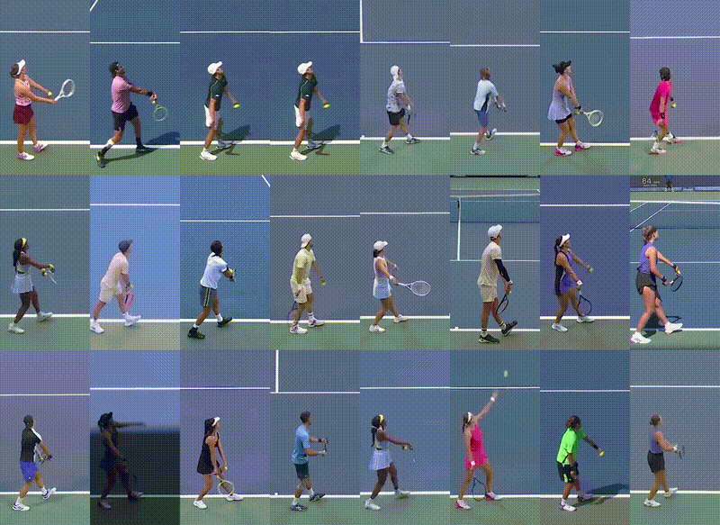
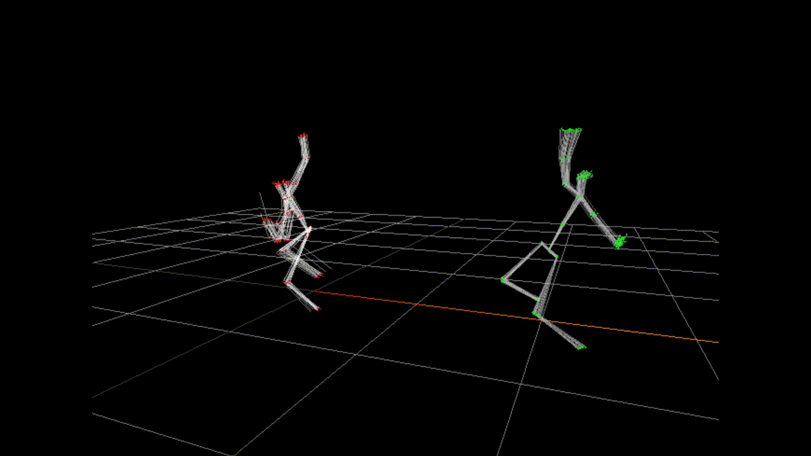
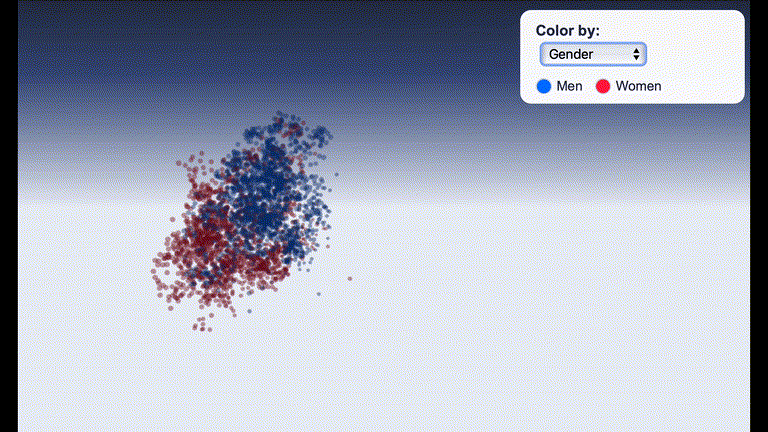
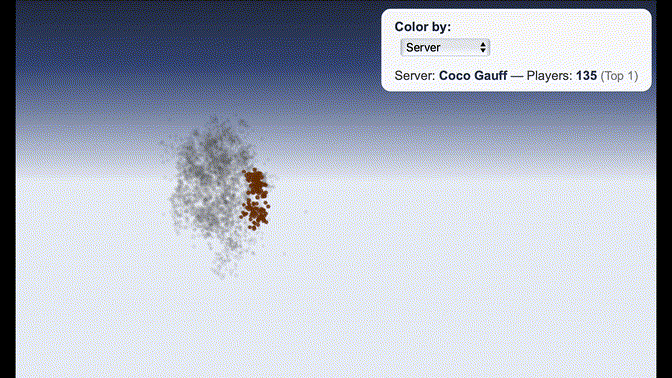

# Tennis Serve Analysis Dataset

**Large-Scale 3D Pose Estimation of Professional Tennis Serves from Broadcast Video**

*Jason Wang, Robert Chen, Patrick Ho, Emmy Kim, Samuel Min, Jaden Shim, Vrishak Vemuri, Derek Wang, Natalie Kupperman, Stephen Baek*
*University of Virginia*

---



### Comparative Skeletal Motion Analysis
<div align="center">
  
  <p><em>Skeletal motion comparison between two players showcasing biomechanical differences in serve technique</em></p>
</div>

### Dimensionality Reduction Visualizations

#### Gender-Based Motion Clustering
<div align="center">
  
  <p><em>3D motion space visualization revealing distinct separation patterns between male and female serve biomechanics</em></p>
</div>

#### Player-Specific Serve Signatures
<div align="center">
  
  <p><em>Individual player clustering in 3D motion space — each player develops unique biomechanical signatures</em></p>
</div>

---

## Overview

This dataset contains **5,966 tennis serves** from the **2024 US Open**, spanning **109 unique players** across **113 matches**. Each serve includes 3D pose sequences, derived biomechanical features (joint angles, angular velocities, angular accelerations), and rich match metadata.

The dataset was constructed using a fully automated pipeline — no manual annotation required — making it scalable to any broadcast tennis footage.

## Pipeline

Serves are extracted from broadcast video through a four-stage pipeline:

1. **Detection** — RTMDet localizes the serving player in each frame
2. **2D Pose Estimation** — RTMPose extracts 17-joint 2D keypoints (COCO format)
3. **3D Lifting** — MotionBERT lifts 2D poses to 3D coordinates
4. **Temporal Alignment** — Dynamic Time Warping (DTW) aligns variable-length sequences to a canonical serve template

The pipeline produces fixed-length 3D pose sequences and derived biomechanical features for each serve.

## Dataset Statistics

| Statistic | Value |
|---|---|
| Total serves | 5,966 |
| Unique players | 109 |
| Matches | 113 |
| Tournament | 2024 US Open |
| Joints per frame | 17 (COCO format) |
| Sequence length | Fixed after DTW alignment |
| Male players | 56 |
| Female players | 53 |

## Data Structure

The dataset is hosted on Google Drive. After downloading, the directory contains:

```
tennis_serve_dataset/
├── keypoints/                  # 3D pose sequences — shape (T, 17, 3)
├── joint_angles/               # Joint angle time series — shape (T, 8)
├── angular_velocities/         # Angular velocity time series — shape (T, 8)
├── angular_accelerations/      # Angular acceleration time series — shape (T, 8)
└── metadata.parquet            # Serve-level metadata (5,966 rows × 20 columns)
```

### Biomechanical Features

The 8 joint angles (and their corresponding velocities/accelerations) are:

| Index | Joint |
|---|---|
| 0 | Left elbow |
| 1 | Right elbow |
| 2 | Left shoulder |
| 3 | Right shoulder |
| 4 | Left hip |
| 5 | Right hip |
| 6 | Left knee |
| 7 | Right knee |

### Metadata Columns

| Column | Description |
|---|---|
| `match_id` | Unique match identifier |
| `server` | Name of the serving player |
| `server_gender` | Gender of server (`M` / `F`) |
| `player1`, `player2` | Match participants |
| `PointServer` | Which player served (1 or 2) |
| `Speed_KMH` | Serve speed in km/h |
| `n_frames` | Number of frames before alignment |
| `SetNo` | Set number |
| `GameNo` | Game number |
| `PointNumber` | Point number |
| `P1Score`, `P2Score` | Point scores |
| `ServeNumber` | First or second serve |
| `ServeResult` | Outcome (Ace, In, Fault, etc.) |
| `match_num` | Match number in tournament |
| `round` | Tournament round |
| `ElapsedTime` | Time elapsed in match |

## Key Results

### Classification Tasks

| Task | Accuracy | Macro F1 | Majority Baseline | Lift |
|---|---|---|---|---|
| Gender | 97.3% | 0.972 | 55.0% | +42.3% |
| Player ID (top 14) | 99.2% | 0.992 | 10.6% | +88.6% |
| Serve quality | 84.0% | 0.757 | 65.0% | +19.1% |

### Speed Prediction (Regression)

| Metric | Value |
|---|---|
| R² | 0.253 |
| MAE | 17.2 km/h |
| RMSE | 20.8 km/h |

## Quick Start

```python
import pandas as pd
import numpy as np

# Load metadata
metadata = pd.read_parquet("metadata.parquet")
print(f"Total serves: {len(metadata)}")
print(f"Unique players: {metadata['server'].nunique()}")

# Load a single serve's 3D keypoints
keypoints = np.load("keypoints/0.npy")   # shape: (T, 17, 3)
angles = np.load("joint_angles/0.npy")   # shape: (T, 8)

print(f"Sequence length: {keypoints.shape[0]} frames")
print(f"Joints: {keypoints.shape[1]}, Coordinates: {keypoints.shape[2]}")
```

## Download

The full dataset is available on Google Drive:

[Download Tennis Serve Dataset](https://drive.google.com/drive/folders/1Wr7UjMvgLwgqCQ09wSaw94ozvRYRO8fB?usp=share_link)

## Citation

If you use this dataset in your research, please cite:

```bibtex
@inproceedings{wang2026largescale,
  title={Large-Scale 3D Pose Estimation of Professional Tennis Serves from Broadcast Video},
  author={Wang, Jason and Chen, Robert and Ho, Patrick and Kim, Emmy and Min, Samuel and Shim, Jaden and Vemuri, Vrishak and Wang, Derek and Kupperman, Natalie and Baek, Stephen},
  booktitle={Proceedings of the IEEE/CVF Conference on Computer Vision and Pattern Recognition Workshops (CVPRW)},
  year={2026}
}
```

## License

This dataset is licensed under the [Creative Commons Attribution 4.0 International License (CC BY 4.0)](LICENSE).

You are free to share and adapt the material for any purpose, provided you give appropriate credit.
